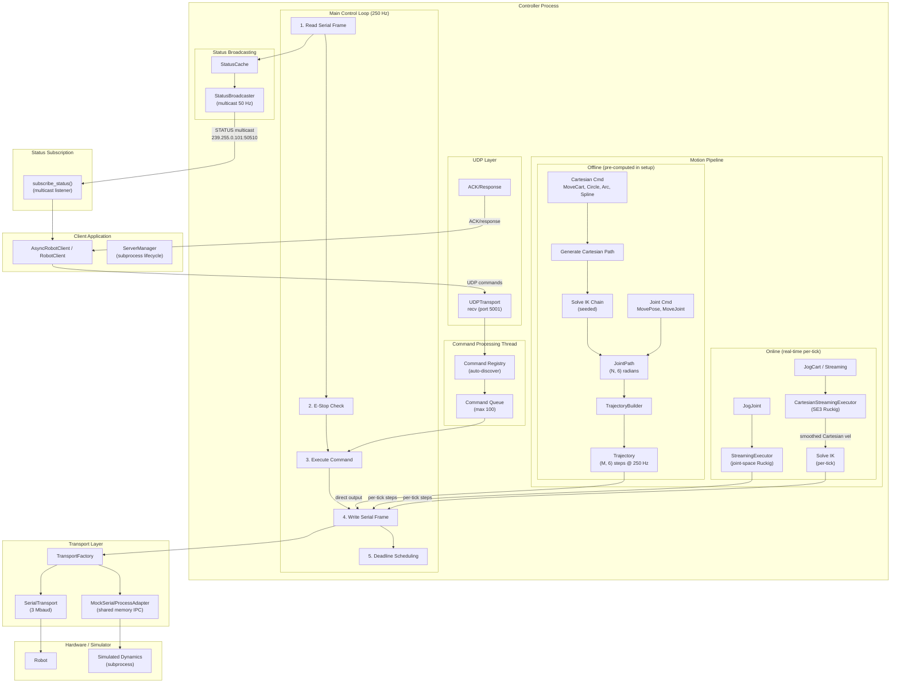

# PAROL6 Python API

Lightweight Python client and controller manager for PAROL6 robot arms.

This package provides:
- AsyncRobotClient (async UDP client)
- RobotClient (sync wrapper around the async client)
- ServerManager utilities (manage_server and CLI parol6-server)

It supports a controller process speaking a simple text-based UDP protocol. The client can run on the same machine or remotely.


## Installation
```bash
pip install .
```

To launch the controller after installation:

```bash
parol6-server --log-level=INFO
```

## Quickstart

### Async client (recommended API)
```python
import asyncio
from parol6 import AsyncRobotClient

async def main():
    async with AsyncRobotClient(host="127.0.0.1", port=5001) as client:
        ready = await client.wait_for_server_ready(timeout=3)
        print("server ready:", ready)
        print("ping:", await client.ping())
        status = await client.get_status()
        print("status keys:", list(status.keys()) if status else None)

asyncio.run(main())
```

### Sync client (convenience wrapper)
```python
from parol6 import RobotClient

with RobotClient(host="127.0.0.1", port=5001) as client:
    print("ping:", client.ping())
    print("pose:", client.get_pose())
```

### Starting/stopping the controller from Python
```python
from parol6 import manage_server, RobotClient

mgr = manage_server(host="127.0.0.1", port=5001)  # blocks until PING works
try:
    with RobotClient() as client:
        print("ready:", client.wait_for_server_ready(timeout=3))
        print("ping:", client.ping())
finally:
    mgr.stop_controller()
```

## Development setup
For contributors working on this repository:

```bash
pip install -e .[dev]
pre-commit install
```

- Run all pre-commit hooks locally: `pre-commit run -a`
- Run tests with pytest:
  - `pytest`
  - Simulator is used by default (PAROL6_FAKE_SERIAL=1). Hardware tests are marked and require explicit opt-in.

Adding a command (overview):
- Create a class under `parol6/commands/` and decorate it with `@register_command("NAME")` (see `parol6/server/command_registry.py`).
- Implement `match(parts)`, `setup(state)`, and `tick(state)`; set `streamable=True` on motion commands that support streaming.
- Use helpers from `parol6/commands/base.py` (parsers, motion profiles). The wire name should match your decorator name.
- *If necessary* Add client method to `async_client.py` and `sync_client.py`.

## Control rate and performance
- Default control loop: `PAROL6_CONTROL_RATE_HZ=250` (chosen for consistent cross-platform behavior)
- Higher control rates require stronger hardware and generally produce smoother motion, but there are diminishing returns—the motion will not become infinitely smooth just by increasing the rate
- If the controller is falling behind you will see warnings like:

  `Control loop avg period degraded by +XX% (avg=Ys target=Zs); latest overrun=Ws`

  If you see this, or motion feels inconsistent, reduce `PAROL6_CONTROL_RATE_HZ`
- TRACE logging impacts performance; enable only when necessary (set `PAROL_TRACE=1` or use `--log-level=TRACE`)

## Streaming mode
- Streaming (`STREAM|ON` / `STREAM|OFF`; `client.stream_on()` / `client.stream_off()`) is intended for high-rate jogging and continuous updates
- In stream mode the server de-duplicates stale inputs, reduces ACK chatter, and can reuse the active streamable command fast-path to minimize overhead
- Use streaming for UI-driven jog or live teleoperation; use non-streaming for discrete motions and queued programs

## Security and multiple senders
**Important:** The controller has no authentication or authorization mechanism. It will accept any correctly parsed command on its UDP port. Deploy only on a trusted local network and avoid exposing the controller to untrusted networks.

*Multiple senders:* The controller intentionally allows commands from multiple senders concurrently. This enables a GUI or higher-level orchestrator to run sub‑programs while another sender can issue commands like STOP. While useful, this design increases the attack surface. Combine it with network isolation (trusted LAN), firewall rules, or host‑level ACLs.

## Architecture overview



### Component summary

- **Client** (`parol6.client`): `AsyncRobotClient` (async UDP), `RobotClient` (sync wrapper), `ServerManager` (subprocess lifecycle)
- **Controller** (`parol6.server.controller`): UDP command server, 250 Hz control loop, command queue, status broadcasting
- **Motion pipeline** (`parol6.motion`): Offline trajectory generation (TOPP-RA, Ruckig, etc.) and online streaming executors
- **Transports** (`parol6.server.transports`): `SerialTransport` (hardware), `MockSerialProcessAdapter` (simulator via shared memory)
- **Status subscription** (`parol6.client.status_subscriber`): Multicast/unicast listener for push-based status updates

### Why multicast status?

The controller pushes status via UDP multicast to avoid client-side polling, reduce command-channel contention, and support multiple observers (GUI, logging). Falls back to unicast when multicast is unavailable (`PAROL6_STATUS_TRANSPORT=UNICAST`).

### Simulator mode

Uses `MockSerialProcessAdapter` with shared memory IPC for subprocess isolation. Toggle via `simulator_on()` / `simulator_off()`. The simulator syncs to controller state on enable for pose continuity. **Note**: Simulation cannot guarantee hardware success—motor/current limits may cause failures on the real robot.


### Motion profiles

Set the motion profile for all moves:

```python
client.set_profile("TOPPRA")  # Default: time-optimal path-following
```

**Available profiles** (`SETPROFILE`):

| Profile | Description |
|---------|-------------|
| **TOPPRA** | Time-optimal path-following (default) |
| **RUCKIG** | Jerk-limited point-to-point motion (joint moves only) |
| **QUINTIC** | C² smooth polynomial trajectories |
| **TRAPEZOID** | Linear segments with parabolic blends |
| **LINEAR** | Direct interpolation (no smoothing) |

Note: RUCKIG is point-to-point only and cannot follow Cartesian paths. When RUCKIG is set, Cartesian moves automatically use TOPPRA instead.

**Offline vs Online**:
- **Offline pipeline** (MoveCart, MoveJoint, Circle, Spline, etc.): Entire trajectory computed during `setup()`, then executed tick-by-tick directly to hardware
- **Online pipeline** (JogCart, JogJoint, streaming): StreamingExecutor uses Ruckig velocity control per-tick for real-time responsiveness

#### Cartesian velocity limiting

For Cartesian moves, joint velocity limits are dynamically scaled to keep TCP velocity within a specified limit. This uses the **local tangent method**:

1. Compute Jacobian J at current configuration
2. For direction toward target: `v_cart = J_linear @ q_dot`
3. Scale joint limits so `||v_cart|| ≤ v_max`

Applied at two levels:
- **TrajectoryBuilder**: Adds `JointVelocityConstraintVarying` to TOPPRA based on path tangent
- **StreamingExecutor**: For position targets, dynamically adjusts Ruckig limits based on direction to target

#### Speed and acceleration

```python
client.move_joint(target, speed=50, accel=50)   # 50% of joint limits
client.move_cart(target, speed=25, accel=100)   # 25% cart speed, full accel
client.move_cart(target, duration=2.0)          # Fixed duration (uses TOPPRAsd)
```

For Cartesian moves, joint limits stay at 100% as hard bounds—speed percentage only affects the Cartesian velocity constraint.


## Kinematics, IK, and singularities
Numerical IK vs. analytical:
- This project uses numerical IK (via robotics-toolbox-python) for flexibility: it adapts to tool changes and hardware modifications without deriving new closed forms
- Trade-offs: numerical IK can be slower and less robust near singularities compared to an ideal analytical solver

Known behaviors and limitations:
- The current robotics-toolbox-python backend used here does not expose null-space manipulation in C. As a result, some cartesian targets can fail to solve—joint 4 (J4) is particularly sensitive. Future work in the ported backend may add null-space features.

Adapting to modified hardware:
- Update `parol6/PAROL6_ROBOT.py` (gear ratios, joint limits, speed/acc/jerk limits)
- Update tool transforms in `parol6/tools.py` (4×4 SE3 matrices)
- Optionally update the URDF in `parol6/urdf_model/` for visualization or geometry changes
- Advanced: you can also add or replace DH joints programmatically without modifying the URDF. For example:

  ```python
  # Example: replace the 3rd joint with a custom DH link without editing the URDF
  from roboticstoolbox import Link, ET
  from parol6.PAROL6_ROBOT import _cached_urdf
  import roboticstoolbox as rtb

  base_links = list(_cached_urdf.elinks)

  # Create a new DH link (Revolute) – customize a, d, alpha, and any fixed offset
  j3_custom = Link(ET.DH(a=0.045, d=0.0, alpha=0.0), name="J3_custom", parent=base_links[1])

  # Rebuild link chain: keep upstream joints as-is, insert replacement, then reuse downstream links
  all_links = [
      base_links[0],           # J1
      base_links[1],           # J2
      j3_custom,               # new J3
      *base_links[3:],         # J4..end reuse
  ]

  robot = rtb.Robot(all_links, name=_cached_urdf.name)
  # Apply a tool afterward if needed (see parol6.tools)
  ```

- Note: The bundled URDF and STL assets have been adjusted from the originals to make robotics‑toolbox‑python Cartesian transforms behave correctly. Programmatic DH edits let you experiment without modifying those files.


## Tools
Currently supported tools (see `parol6/tools.py`):
- `NONE` (bare flange)
- `PNEUMATIC` (pneumatic gripper)

Set tool at runtime from the client:
```python
from parol6 import RobotClient
with RobotClient() as c:
    c.set_tool("PNEUMATIC")
```

Add a new tool by extending `TOOL_CONFIGS` with a name, description, and `transform` (SE3 → 4×4 matrix).


## Environment variables
- `PAROL6_CONTROL_RATE_HZ` — control loop frequency in Hz (default 250)
- `PAROL6_STATUS_RATE_HZ` — STATUS broadcast rate in Hz (default 50)
- `PAROL6_STATUS_STALE_S` — skip broadcast if cache is older than this (default 0.2)
- `PAROL6_MCAST_GROUP` — multicast group for status (default 239.255.0.101)
- `PAROL6_MCAST_PORT` — multicast port for status (default 50510)
- `PAROL6_MCAST_TTL` — multicast TTL (default 1)
- `PAROL6_MCAST_IF` — interface/IP for multicast (default 127.0.0.1)
- `PAROL6_STATUS_TRANSPORT` — MULTICAST (default) or UNICAST
- `PAROL6_STATUS_UNICAST_HOST` — unicast target host (default 127.0.0.1)
- `PAROL6_CONTROLLER_IP` / `PAROL6_CONTROLLER_PORT` — bind host/port for controller
- `PAROL6_FORCE_ACK` — force ACK for motion commands regardless of policy
- `PAROL6_FAKE_SERIAL` — enable simulator ("1"/"true"/"on"); used internally by simulator_on/off
- `PAROL6_TX_KEEPALIVE_S` — TX keepalive period seconds for serial writes (default 0.2)
- `PAROL6_COM_FILE` — path to persistent COM port file (default `~/.parol6/com_port.txt`)
- `PAROL6_COM_PORT` / `PAROL6_SERIAL` — explicit serial port override (e.g., `/dev/ttyUSB0` or `COM3`)
- `PAROL_TRACE` — `1` enables TRACE logging level unless overridden by CLI


## FAQ / Troubleshooting
- I see `Control loop avg period degraded by …` warnings
  - The loop is falling behind. Reduce `PAROL6_CONTROL_RATE_HZ` and ensure TRACE and DEBUG logging is disabled.
- Motion feels inconsistent or jittery on my machine
  - Lower the control rate; avoid heavy background tasks; disable TRACE and DEBUG logging.
- Some cartesian targets fail to solve (especially around J4)
  - Without null-space control in the backend, some poses are hard to reach. Re-plan the path, adjust the target, or change the starting posture. Future backend updates may add null-space manipulation.


## Safety notes
- Keep physical E‑Stop accessible at all times when connected to hardware
- The controller can halt motion via `disable()/stop()` and reacts to E‑Stop inputs when on real hardware
- Prefer `simulator_on()` for development without hardware and validate motions before switching to real serial
